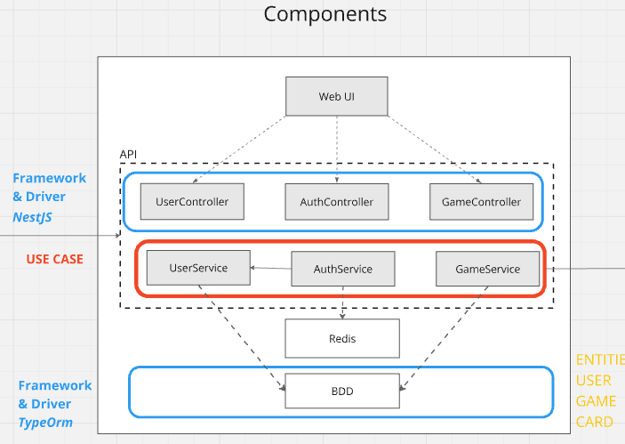
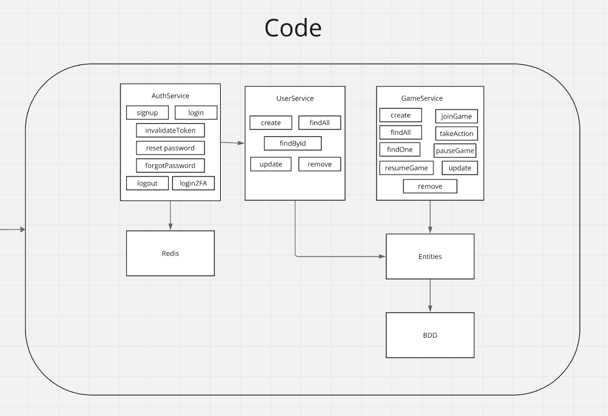

# Projet Skyjo
## Table des matières
- [IMPORTANT](#important)
- [Le projet, en quelques lignes](#le-projet-en-quelques-lignes)
- [Membres](#membres)
- [Lancer le projet](#lancer-le-projet)
  - [Prerequis](#prerequis)
  - [Installation](#installation)
- [Les Patterns utilisés](#les-patterns-utilisés)
  - [Singleton](#singleton)
  - [State](#state)
  - [Decorator](#decorator)
- [Techno](#techno)
  - [NestJs](#nestjs)
  - [ReactJs](#reactjs)
  - [Docker](#docker)
- [Diagramme C4](#diagramme-c4)

## IMPORTANT
**Le répertoire possède deux branches :**
- **main** : contient l'application des différents patterns, un jeux fonctionnel via API et une interface homme machine (bonus).
- **bonus** : contient l'application jouable en CLI, une clean architecture et des tests unitaires. (les instruction pour lancer l'application en CLI sont dans le README.md de la branche bonus)

## Le projet, en quelques lignes
"Skyjo" est un jeu de cartes digitalisé. Le projet consiste en une application web full-stack où les joueurs peuvent créer/rejoindre des parties avec leurs amis. L'objectif du jeu est d'avoir le score total le plus bas en révélant et en remplaçant des cartes de sa main. Le projet est sur une architecture monorepo avec une API en NestJS, une interface utilisateur frontend en ReactJs, et des conteneurs Docker pour simplifier le développement.

## Membres : 
- DUPUY Tom
- MENGELATTE Guillaume

## Lancer le projet

### Prerequis
- Node.js
- PNPM package manager (`npm install -g pnpm`)
- Docker et Docker Compose

### Installation

From project root:

1. Installer les dépendances :
   ```bash
   pnpm i
    ```
2. Lancer les conteneurs dockers
    ```bash
    make up
    or
    docker-compose up -d
    ```
3. Lancer les serveurs de développements
    ```bash
    // API
    make api
    or
    pnpm run dev:api
    
    // UI
    make ui
    or
    pnpm run dev:ui
    ```
4. Ouvrir le navigateur sur http://localhost:5173/ ou suivre les instruction de la console


## Les Patterns utilisés
### Singleton
Le pattern Singleton est utilisé pour la classe `GameService` afin de garantir qu'il n'y ait qu'une seule instance de la classe en cours d'exécution. Cela permet de partager l'état du jeu entre les différentes parties de l'application. Ansi que la base de données Postgres et Redis qui est instanciée une seule fois dans le fichier `app.module.ts` et est injectée dans les services.

### State
Le pattern State est utilisé pour gérer l'état du jeu. Chaque partie de jeu est associée à un état de jeu qui est stocké en base de donnée ("PLAYING" / "PAUSED" / "FINISHED" ). Cela permet de gérer les transitions de l'état du jeu de manière propre et de garantir que les actions des joueurs sont valides.

### Decorator
Le pattern Decorator est utilisé pour les contrôleurs de l'API. Les décorateurs sont utilisés pour définir les routes, les middlewares, les paramètres de requête, etc. Cela permet de séparer la logique de routage de la logique métier ("@Public", "AuthenticationGuard").

## Techno:
### NestJs
NestJS a été choisi comme framework backend pour :
- **Architecture modulaire** : Particulièrement adaptée pour organiser la logique de jeu en composants distincts (gestion des joueurs, règles de jeu, authentification)
- **Décorateurs et pipes** : Simplifie la validation des données et la documentation API avec Swagger
- **Injection de dépendances** : Permet de structurer proprement le code et facilite les tests unitaires

### ReactJs
React a été sélectionné pour le frontend pour :
- **DOM virtuel** : Offre des performances optimales lors des mises à jour fréquentes de l'état du jeu
- **Compatibilité TypeScript** : Assure la cohérence des types entre le frontend et le backend

### Docker
Docker pour :
- **Services isolés** : Permet d'exécuter facilement la base de données, Redis, et les services mail en développement
- **Configuration simplifiée** : Mise en place rapide de l'environnement avec docker-compose

## Diagramme C4





